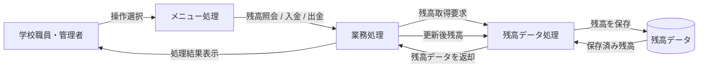

# 学校会計システム用 COBOL プログラムの概要

## 目的

このドキュメントは、学校の会計システムを想定した COBOL プログラム群の主要機能とビジネス要件をまとめたものです。既存のレガシー COBOL コードを理解し、今後のモダナイズ作業に備えるための資料として利用します。

## 対象システム

学校の会計管理において、教職員または管理者が口座残高の確認、入金、出金を行える簡易的な会計処理システムを想定しています。

## 主要機能

### 1. 残高照会
- 現在の残高を表示できます。
- 会計処理の基礎となる情報として利用されます。

### 2. 入金処理
- 入金額を入力し、残高に加算します。
- 追加された金額と更新後の残高を表示します。

### 3. 出金処理
- 出金額を入力し、残高から減算します。
- 残高不足の場合は処理を中断し、エラー内容を表示します。

### 4. メニュー操作
- ユーザーが操作を選択できる対話型メニューを提供します。
- 画面上で残高照会、入金、出金、終了を選択できます。

## ビジネス要件

- 口座残高を常に管理できること
- 利用者が残高の確認、入金、出金を実行できること
- 出金時には残高不足を防ぐために十分な検証を行うこと
- 処理結果を画面に表示し、操作の流れを分かりやすくすること
- 将来的なモダナイズを前提に、機能単位で処理を分割していること

## プログラム構成

- main.cob
  - ユーザーインターフェースを担当し、メニュー表示と操作選択を処理します。

- operations.cob
  - 入金・出金・残高照会の業務ロジックを担当します。
  - データ保存処理を呼び出して、残高の更新や表示を行います。

- data.cob
  - 残高データの読み取りと書き込みを担当します。
  - 現在の残高の保持と更新を管理します。

## DFD 図

## 期待される運用イメージ

このシステムは、学校の会計業務の簡易版として、口座残高の管理や各種取引の記録に利用することを想定しています。今後の改修では、データベース連携やWeb画面化、入力バリデーション強化などを行うことが考えられます。
