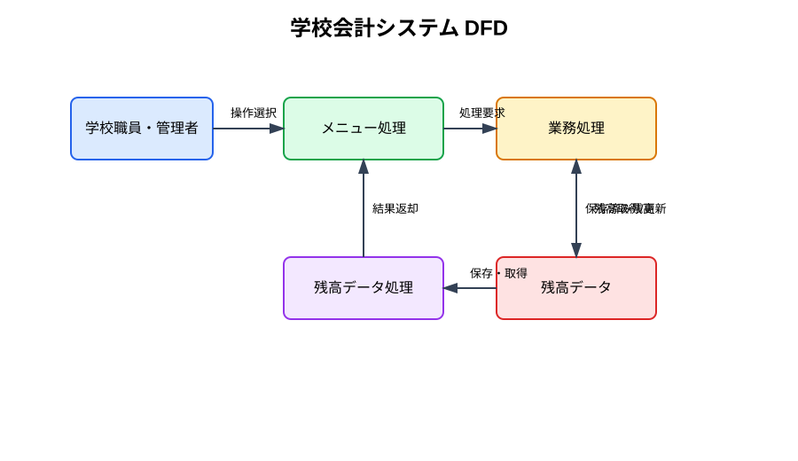

# データフロー図 (DFD)

## 学校会計システムのデータ移動

以下の図は、学校会計システムにおけるデータの流れを示しています。ユーザーの操作から、残高の読み取り・更新、結果表示までを一目で把握できます。

## 各要素の役割

- 学校職員・管理者
  - 画面上で操作を選択します。

- メニュー処理
  - 利用者の選択内容を受け取り、適切な業務処理へ振り分けます。

- 業務処理
  - 入金・出金・残高照会の処理を実行します。

- 残高データ処理
  - 残高の読み取りと更新を担当します。

- 残高データ
  - 現在の残高情報を保持するデータストアです。

## データの流れ

1. 利用者が「残高照会」「入金」「出金」を選択します。
2. メニュー処理が要求内容を業務処理に渡します。
3. 業務処理が残高データ処理に対して残高の読み取りまたは更新を依頼します。
4. 残高データ処理がデータストアから残高を取得・保存します。
5. 更新結果を利用者へ表示します。
